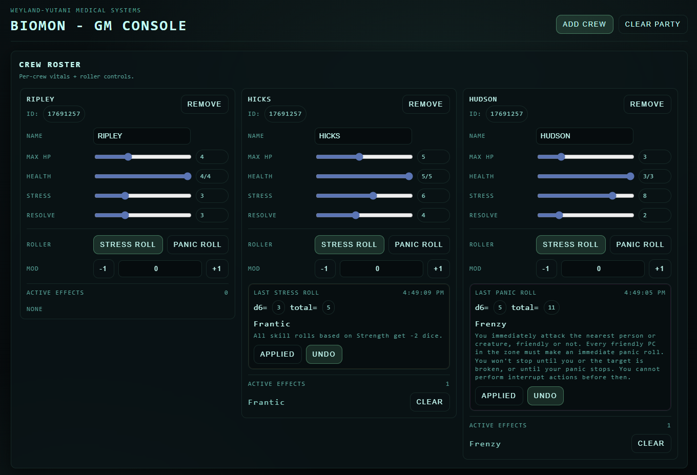
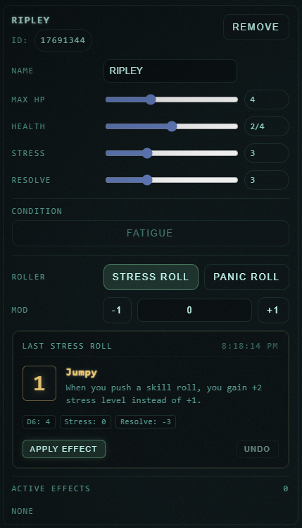
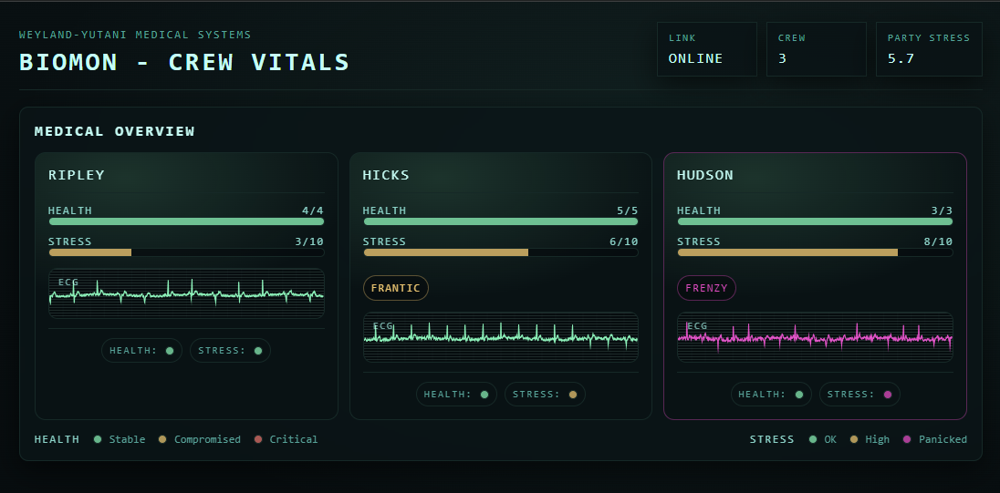
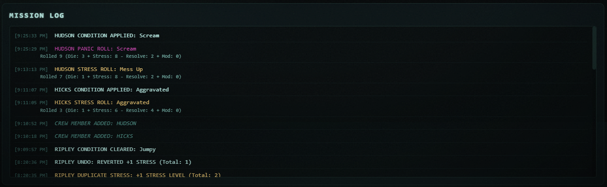

# BIOMON

[](https://creativecommons.org/licenses/by-nc-sa/4.0/)
[](https://nodejs.org/)
[](https://github.com/thedandroid/biomon)

> **Biological Monitoring System** — A Weyland-Yutani medical terminal for tracking crew vitals, stress, and panic responses in *Alien RPG* games.

A lightweight, diegetic party status tracker with an integrated **Stress & Panic Roller** for *Alien RPG*. Styled as a retro medical console with real-time ECG animations and atmospheric Weyland-Yutani theming.

---

## Table of Contents

- [Screenshots](#screenshots)
- [Features](#features)
- [Quick Start](#quick-start)
- [How It Works](#how-it-works)
- [Session Persistence](#session-persistence)
- [GM View — How to Use](#gm-view--how-to-use)
- [Player View — What Players See](#player-view--what-players-see)
- [Customization](#customization)
- [Testing](#testing)
- [Tech Stack](#tech-stack)
- [Project Structure](#project-structure)
- [License](#license)
- [Contributing](#contributing)

---

## Screenshots

### GM View

The Game Master interface for managing players and triggering stress/panic rolls.



### Roller Panel

Close-up of the integrated dice roller with automatic table lookup.



### Player View

What players see - their crew's vitals with real-time ECG animations and effect indicators.



### Mission Log

The GM's roll feed showing the complete history of stress and panic events.



---

## Features

- **Real-time crew monitoring** - Track health, stress, resolve, and fatigue for all players
- **Integrated dice roller** - Automated Stress and Panic rolls with table lookup
- **Auto-save & persistence** - Automatic state saving with campaign management
- **Diegetic UI** - Medical terminal aesthetic with ECG waveforms
- **GM & Player views** - Separate interfaces for game master and players
- **Effect tracking** - Persistent panic/stress effects and conditions with visual indicators
- **Session management** - Save/load campaigns, export/import backups
- **No database required** - File-based persistence, zero setup complexity

---

## Quick Start

### Option 1: Standalone Application (Recommended)

**No installation required.**

1.  Download the latest release for your platform from [Releases](https://github.com/thedandroid/biomon/releases):
    - **Windows**: `biomon-win-x64.exe.zip`
    - **macOS**: `biomon-macos-x64.zip`
    - **Linux**: `biomon-linux-x64.zip`
2.  Extract the `.zip` file (contains the executable + `public/` folder).
3.  Run the executable:
    - **Windows**: Double-click `biomon-win-x64.exe`
    - **macOS/Linux**: `./biomon-macos-x64` or `./biomon-linux-x64`
4.  A terminal window will open showing the server address.
5.  Open your browser to:
    - **GM View**: [http://localhost:3050/gm](http://localhost:3050/gm)
    - **Player View**: [http://localhost:3050/](http://localhost:3050/)

**Note**: Keep the `public/` folder in the same directory as the executable. The `sessions/` directory will be created automatically in the current working directory.

### Option 2: Run from Source

#### Installation

```bash
npm install
```

#### Running the Server

```bash
npm start
# or
node server.js
```

#### Access the App

- **GM View**: [http://localhost:3050/gm](http://localhost:3050/gm)
- **Player View**: [http://localhost:3050/](http://localhost:3050/)

Default port is `3050` (override with `PORT` environment variable).

---

## How It Works

BIOMON automates stress and panic resolution for *Alien RPG* games:

### Stress Rolls

When the GM triggers a **Stress Roll**, the tool:
1. Rolls a d6 automatically
2. Calculates: `d6 + current_stress - resolve + modifiers`
3. Looks up the result on the Stress Table
4. Displays the effect and applies it to the player

### Panic Rolls

When the GM triggers a **Panic Roll**, the tool:
1. Rolls a d6 automatically
2. Calculates: `d6 + current_stress - resolve + modifiers`
3. Looks up the result on the Panic Table
4. Displays the effect and applies it to the player

Both roll types use the same formula but consult different tables for the outcome.

---

## Session Persistence

BIOMON automatically saves your game state and supports campaign management.

### Auto-Save

- **Automatic backup** - State saved to `sessions/autosave.json` after every change
- **Crash protection** - Server restart automatically recovers your session
- **Debounced writes** - Saves at most once per second to avoid excessive disk I/O
- **Recovery notification** - GM receives alert when previous session is restored

### Campaign Management

Access via the **SESSION** button in the GM view:

- **Save Campaign** - Name and save your campaign with metadata
  - Tracks campaign name, save date, player count, session number
  - Files saved as `sessions/campaign-{name}.json`
- **Load Campaign** - Browse and restore previously saved campaigns
- **New Session** - Clear current state and start fresh
- **Export Backup** - Download session as JSON to your computer
- **Import Backup** - Restore from a previously exported file

### Use Cases

- **One-shots** - Auto-save protects against mid-session crashes
- **Campaigns** - Save at end of each session, load to continue
- **Multiple games** - Manage separate campaigns with unique names
- **Backup strategy** - Export important campaigns to external storage

---

## GM View — How to Use

### Player Management

Each player card displays:
- **Name** and **ID**
- **Health**, **Stress**, and **Resolve** sliders
- **Fatigue toggle** - Click to mark/unmark a player as fatigued
- **Active effects** (persistent panic/stress conditions)
- **Roller panel** for triggering rolls

### Roller Panel

- **STRESS ROLL** — Click when a skill check's Stress Dice include **one or more 1s**
- **PANIC ROLL** — Click only when the GM explicitly calls for a panic roll
- **MOD** — Situational modifiers (quick `-1`/`+1` buttons and direct input)
- **Output** — Shows `d6` result, computed total, and resolved table entry (label + short description)
- **APPLY** — Marks the roll as applied; adds persistent effect tag if applicable
- **UNDO** — Reverses the last Apply (clears the effect if one was created)
- **ACTIVE EFFECTS** — Persistent tags (including Fatigue) can be manually **CLEARED**

### Roll Feed

- Live feed of all roll events
- Shows player name, roll type, result, and effect
- Limited to most recent rolls

---

## Player View — What Players See

The player view displays the full crew roster with real-time updates:

### Crew Cards

Each player card shows:
- **Name** and **ID**
- **Health**, **Stress**, and **Resolve** levels
- **Active effects** (persistent conditions including Fatigue)
- **Real-time ECG animation** reflecting their current state

### Visual Feedback

- When a roll happens, the affected player's card shows a **brief alert banner** with the effect label
- Persistent effects (including Fatigue) show as **tags** with color-coded severity
- **ECG animation changes**:
  - **Stress Roll** → Subtle warning / mild disturbance
  - **Panic Roll** → Strong warning / large spike
  - If a persistent panic-tagged effect is active, the card keeps a visible panic indicator until cleared

### Read-Only Interface

- Players can see everyone's stats and conditions
- No controls or editing capabilities (GM-only)
- Perfect for display on a shared screen or individual devices

---

## Customization

### Stress & Panic Tables

The Stress/Panic tables are defined in [`responseTables.js`](responseTables.js).

This repository includes a **small placeholder set** (range-based entries). You can customize:
- Roll ranges (min/max)
- Effect labels and descriptions
- Persistent vs. temporary effects
- Severity levels

### Validation

Run the self-check to validate your tables:

```bash
npm run selfcheck
```

This ensures all possible roll totals resolve to a valid table entry.

---

## Testing

```bash
npm test                 # Run all tests
npm run test:watch       # Watch mode
npm run test:coverage    # Coverage report
npm run test:ui          # Interactive UI
```

**Test Framework**: Vitest with 67 tests covering utilities, table logic, and Socket.io integration.

### Building the Standalone App

To create the standalone executable yourself:

```bash
npm run build
```

This generates:
- Bundled server: `dist/server.bundled.cjs`
- Executable: `dist/biomon-win-x64.exe` (or platform equivalent)
- Static assets: `dist/public/` (copied automatically)

The executable requires the `public/` folder to be in the same directory.

---

## Tech Stack

- **Backend**: Node.js, Express v5, Socket.io v4
- **Frontend**: Vanilla JavaScript (no frameworks), HTML5, CSS3
- **Persistence**: File-based JSON storage (auto-save + campaigns)
- **No TypeScript**: Pure JavaScript implementation
- **No Build Tools**: Static file serving
- **No Database**: Simple JSON files for state

---

## Project Structure

```
biomon/
├── server.js              # Express/Socket.io server
├── responseTables.js      # Stress & Panic table definitions
├── utils.js               # Shared utility functions
├── sessions/              # Saved game state (gitignored)
│   ├── autosave.json     # Auto-saved state
│   └── campaign-*.json   # Named campaign saves
├── public/                # Static frontend files
│   ├── gm.html           # GM view
│   ├── gm.js             # GM logic
│   ├── player.html       # Player view
│   ├── player.js         # Player logic + ECG animation
│   └── styles.css        # Medical console theming
└── test/                  # Test suite
```

---

## License

[Creative Commons Attribution-NonCommercial-ShareAlike 4.0 International](https://creativecommons.org/licenses/by-nc-sa/4.0/)

This project is free to use, modify, and share for non-commercial purposes. See [LICENSE](LICENSE) for details.

---

## Contributing

Issues and pull requests welcome! See [`AGENTS.md`](AGENTS.md) for coding guidelines.

### Development

```bash
# Install dependencies
npm install

# Run tests
npm test

# Run tests in watch mode
npm run test:watch

# Run linter
npm run lint

# Auto-fix lint issues
npm run lint:fix
```

---

## FAQ

### Can I use this for online games?

Yes! Just forward port 3050 or deploy to a server. Players connect via your server's URL.

### Does it work with other RPG systems?

The core concept works for any game with stress/panic mechanics. You'd need to customize the tables in `responseTables.js` to match your system's rules.

### What happens if the server restarts?

No problem! BIOMON automatically saves your state and restores it on startup. Your session will be recovered with all players, stats, and roll history intact.

### How do I backup my campaigns?

Multiple options:
- **Auto-save**: Runs automatically, saved to `sessions/autosave.json`
- **Named campaigns**: Click SESSION → Save Campaign (stored in `sessions/` directory)
- **Export backup**: Download JSON file to your computer for external backup
- **File system**: Copy the entire `sessions/` directory

### Can I customize the look?

Absolutely! Edit `public/styles.css` to change colors, fonts, and styling. The Weyland-Yutani medical terminal theme is fully customizable.

---

## Acknowledgments

Built for the *Alien RPG* community. Weyland-Yutani aesthetic inspired by the Alien franchise.

---

## Support

Found a bug? Have a feature request? [Open an issue](https://github.com/thedandroid/biomon/issues) on GitHub!
